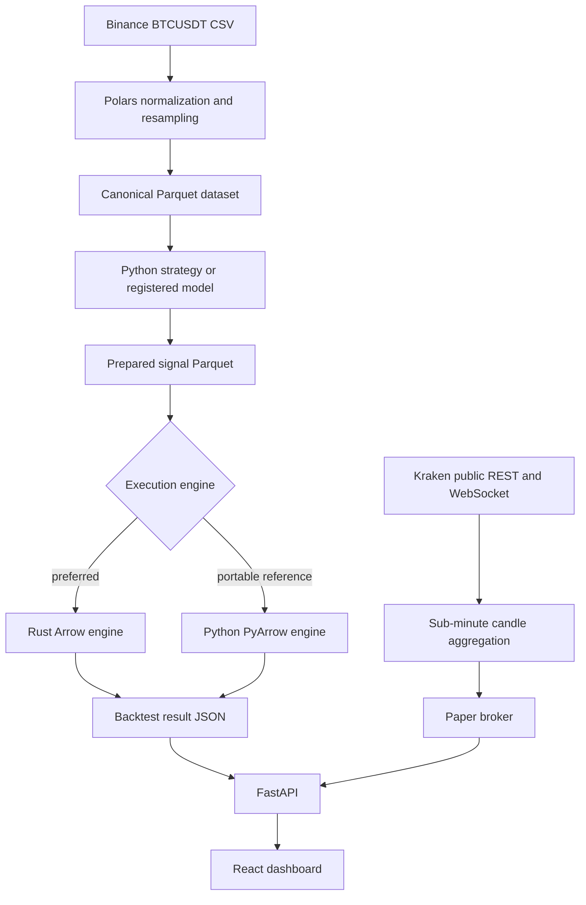

# Meteor Quant

**Cross-platform Deep Learning trading strategies research, backtesting, and paper trading.**

Meteor Quant combines a Polars research layer, an event-driven Rust execution engine, a Python reference engine, a FastAPI control plane, and a React dashboard. It is designed for reproducible strategy research rather than live-money execution.

> **Safety boundary:** Public Meteor Quant is paper-only BTC/USD on Kraken. It cannot submit live orders.

## Highlights

- Multi-year BTCUSDT research from one-second CSV data.
- Deterministic next-bar-open execution with explicit fees, spread, slippage, leverage, and shorting controls.
- Native Rust/Arrow backtester with an independently implemented Python/PyArrow fallback.
- Kraken BTC/USD paper trading on 1s, 5s, 15s, 30s, and standard minute/hour intervals.
- Python strategy plugin SDK with schema-driven dashboard forms.
- Built-in SMA crossover, RSI mean reversion, and WaveTrend strategies.
- MarketLM training and registered forecast indicators.
- Staged MarketHybrid training: representation pretraining, joint training, and policy fine-tuning.
- TimesFM 2.5 integration for zero-shot forecast indicators.
- Forecast q10/median/q90 price overlays on the same BTC/USD scale as candles.
- Docker, Windows PowerShell, Linux/macOS shell, and pure-Python fallback support.

## Scope

This public edition intentionally excludes the experimental strategies and its large parameter-search/cache subsystem. The repository contains the stable platform, baseline strategies, model pipelines, and paper-trading infrastructure without research-specific artifacts.

## Architecture



## Requirements

Core platform:

- Python 3.11 or newer, 64-bit.
- Windows, Linux, or macOS.

Optional components:

- Node.js 22+ to rebuild the dashboard. A prebuilt dashboard is included.
- Rust stable to build the native engine. The Python engine works without Rust.
- CUDA-enabled PyTorch for practical MarketLM/MarketHybrid training.
- TimesFM dependencies for the TimesFM indicator.

## Quick start

### Linux or macOS

```bash
./install.sh --dev
./run.sh
```

### Windows PowerShell

```powershell
.\install.ps1 --dev
.\run.ps1
```

Open `http://127.0.0.1:8000`.

The installer creates `.venv`, installs the package, and leaves ML and build tools optional.

### Install optional capabilities

```bash
# MarketLM
./install.sh --marketlm

# MarketHybrid
./install.sh --markethybrid

# TimesFM
./install.sh --timesfm

# Everything plus development tools, frontend, and Rust
./install.sh --dev --ml --frontend --rust
```

PowerShell accepts the same flags:

```powershell
.\install.ps1 --dev --marketlm --markethybrid
```

### Docker

```bash
docker compose up --build
```

The dashboard is available at `http://127.0.0.1:8000`. Mount raw data into `./data` before preparing a dataset.

## Data

Meteor Quant discovers the following source files recursively under `data/`:

```text
2021-02-23_2026-07-12_BTCUSDT_1s.csv
```

Expected columns:

```text
Open Time
Date
Open
High
Low
Close
Volume
Close Time
Quote Asset Volume
Number of Trades
Taker Buy Base Asset Volume
Taker Buy Quote Asset
```

`Taker Buy Quote Asset Volume` is accepted as an alias for the final column.

Place files directly in `data/` or `data/raw/`, then run:

```bash
./prepare-data.sh
```

Windows:

```powershell
.\prepare-data.ps1
```

The preparation pipeline validates headers, parses timestamps, preserves chronological ordering, normalizes numeric types, and writes Zstandard-compressed Parquet with metadata.

## Backtesting

The dashboard supports:

- explicit or full-history ranges;
- 1s, 5s, 15s, 1m, 5m, 15m, and 1h research bars;
- Rust-required, automatic, or Python reference execution;
- configurable initial equity, fees, spread, slippage, leverage, and shorting;
- candles, volume, indicators, fills, equity, drawdown, fees, and buy-and-hold comparison.

### Causal execution contract

For every strategy:

1. Bar `N` closes.
2. The strategy computes a target using information available through bar `N`.
3. A changed target becomes pending.
4. The rebalance fills at bar `N+1` open.
5. Fees, half-spread, and slippage are applied.
6. Equity is marked at bar `N+1` close.

Unchanged targets do not generate repeated fills.

## Kraken paper trading

Meteor Quant uses Kraken public market data only.

Sub-minute sessions reconstruct 1s, 5s, 15s, or 30s candles from recent trades, then continue through the Kraken WebSocket trade feed. Standard intervals use public OHLC data. Closed bars, fills, and equity snapshots are stored locally in SQLite.

Paper controls include:

- strategy and validated parameters;
- live timeframe;
- bootstrap history;
- initial equity;
- fee and slippage assumptions;
- leverage and shorting policy.

Kraken bid/ask data provides the live spread. No private API key is requested or stored.

See [`docs/KRAKEN_SUBMINUTE_PAPER.md`](docs/KRAKEN_SUBMINUTE_PAPER.md).

## Strategy plugins

Drop Python modules into `user_strategies/` and reload strategies in the dashboard.

A plugin subclasses `StrategyPlugin` and implements:

- `build_signals()` for causal historical Polars expressions;
- `on_live_bar()` for paper trading;
- a Pydantic parameter model;
- optional chart indicator metadata.

Start with [`user_strategies/example_strategy.py`](user_strategies/example_strategy.py) and [`docs/STRATEGY_API.md`](docs/STRATEGY_API.md).

## MarketLM

MarketLM is a causal patch-based transformer for market time series. It trains from the same canonical data used by the backtester, supports indicator features, and registers checkpoints as normal strategy/indicator entries.

```bash
./setup-marketlm.sh
```

Windows:

```powershell
.\setup-marketlm.ps1
```

See [`docs/MARKETLM.md`](docs/MARKETLM.md).

## MarketHybrid

MarketHybrid combines MarketLM-style forecasting, an EMA target encoder, JEPA latent prediction, actionability classification, and policy heads.

The default schedule is:

```text
0–8,000       representation pretraining
8,001–24,000  joint training
24,001–40,000 policy fine-tuning
```

The default profile is [`configs/markethybrid-15s-quality-4060ti.json`](configs/markethybrid-15s-quality-4060ti.json).

Useful commands:

```bash
meteor print-markethybrid-default-config
meteor validate-markethybrid-config --config configs/markethybrid-15s-quality-4060ti.json
meteor start-markethybrid --config configs/markethybrid-15s-quality-4060ti.json
meteor markethybrid-status --run-id <run-id>
meteor register-markethybrid --run-id <run-id> --checkpoint best_hybrid
```

See [`docs/MARKETHYBRID_STAGED_TRAINING.md`](docs/MARKETHYBRID_STAGED_TRAINING.md).

## TimesFM

Install and optionally pre-download TimesFM:

```bash
./setup-timesfm.sh
./download-timesfm.sh
```

The integration performs causal rolling inference and exposes median and q10/q90 price forecasts. See [`docs/TIMESFM.md`](docs/TIMESFM.md).

## Command-line interface

```text
meteor serve
meteor prepare-data
meteor start-markethybrid
meteor markethybrid-status
meteor stop-markethybrid
meteor register-markethybrid
meteor print-markethybrid-default-config
meteor validate-markethybrid-config
```

`mq` is an alias for `meteor`.

## Development

Install development dependencies and rebuild the dashboard:

```bash
./install.sh --dev --frontend
```

Run checks:

```bash
python -m pytest
python -m ruff check src tests scripts
python -m mypy src/meteor_quant
cd frontend && npm run build
```

Build the Python artifacts:

```bash
python -m build
```

Build the Rust engine:

```bash
./build-rust.sh
```

Or use the Makefile:

```bash
make install-dev
make check
make run
```

## Project layout

```text
meteor-quant/
├── src/meteor_quant/       Python application and research stack
├── rust/meteor-engine/     Native event-driven backtest engine
├── frontend/               React dashboard
├── configs/                Versioned model configurations
├── docs/                   Architecture and feature documentation
├── tests/                  API, engine, strategy, model, and Kraken tests
├── user_strategies/        Local strategy plugins
├── data/                   Ignored local market data and generated artifacts
├── scripts/                Cross-platform development helpers
├── Dockerfile
└── docker-compose.yml
```

## Design principles

- **Causal by construction:** strategy decisions are delayed to the next bar open.
- **One accounting authority:** execution engines own cash, positions, fees, and equity.
- **Portable fallback:** Python and Rust implement the same event contract independently.
- **Columnar data:** large market histories remain in Parquet rather than SQLite.
- **Schema-driven extensions:** strategy and model parameters are validated with Pydantic.
- **Paper-only safety:** no private exchange credentials and no live-order endpoint.
- **Reproducibility:** model configurations, cache fingerprints, checkpoints, and tests are versioned.

## Limitations

- The bundled dataset catalog targets BTCUSDT source files; multi-symbol research is not yet implemented.
- The dashboard is a single-user local application and does not include authentication.
- Model quality and strategy profitability are not guaranteed.
- Live trading is intentionally outside the project scope.
- Practical neural-model training generally requires a CUDA GPU.

## Documentation

- [`docs/QUICKSTART.md`](docs/QUICKSTART.md)
- [`docs/ARCHITECTURE.md`](docs/ARCHITECTURE.md)
- [`docs/STRATEGY_API.md`](docs/STRATEGY_API.md)
- [`docs/KRAKEN_SUBMINUTE_PAPER.md`](docs/KRAKEN_SUBMINUTE_PAPER.md)
- [`docs/MARKETLM.md`](docs/MARKETLM.md)
- [`docs/MARKETHYBRID.md`](docs/MARKETHYBRID.md)
- [`docs/MARKETHYBRID_STAGED_TRAINING.md`](docs/MARKETHYBRID_STAGED_TRAINING.md)
- [`docs/TIMESFM.md`](docs/TIMESFM.md)
- [`docs/SHARED_PRICE_SCALE.md`](docs/SHARED_PRICE_SCALE.md)
- [`docs/VERIFICATION.md`](docs/VERIFICATION.md)

## License

MIT. See [`LICENSE`](LICENSE).
